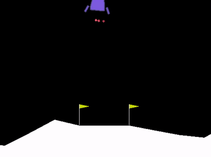
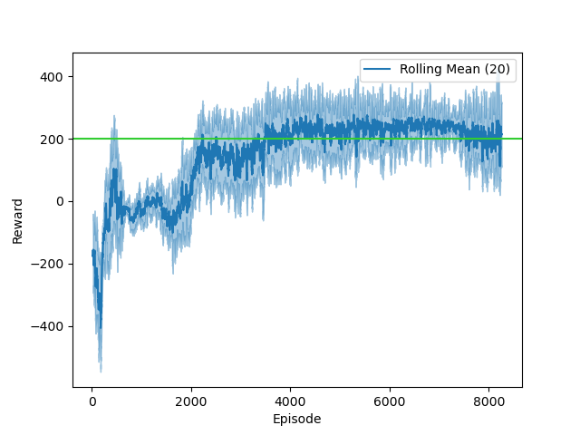

# Lunar Lander
#### By Logan Jones

This is adapted from a project I did for my master's degree in the GA Tech OMSCS program.
The goal was to solve the [Lunar Lander (v2) environment](http://gym.openai.com/envs/LunarLander-v2/) provided with the OpenAI Gym.
I was very excited about the semi-recent advancement of DeepMind's Deep Q-Networks, 
and so I did a custom implementation built only using the DQN paper "Human-level control through deep reinforcement learning." 
for reference (Mnih Volodymyr et al. 2015).

At the time, I used Keras (and Python 2.7), but I have since grown more fond of PyTorch (and Python 3), 
so this is essentially a port of that project.  I made several improvements in how the exploration is done and how the results are recorded.
I also noticed a big speedup in processing as it seems PyTorch/Python 3 is much better at parallel processing than Keras/Python 2.7.

See [a video](https://github.com/logar16/LunarLander/blob/master/docs/Flight%20Demonstration.mp4) of a simple, randomly picked agent configuration trained for 15,000 episodes and flying really good (or just enjoy the shorter clip below).



Note that the agent is only given 8 inputs (floating point numbers stacked over 3 frames) and has 4 actions it can take.  
The fact that it can identify where it is and how to land itself is pretty impressive.

## Agent Performance  
I provide options for training both a standard linear network or one with RNN (LSTM or GRU) capabilities.
For as fast convergence as possible, use the linear model, it is simpler and can learn a solid policy quite quickly.

For example, here is one trained with an Adadelta optimizer for 400 episodes (160,000 steps)

#### Reward per Episode
_episodes.png)

#### Reward per step
_steps.png)

#### Evaluation (100 trials)
_trial100_episodes.png)

I ran the model 5 times with the same configuration and it ended above 200 reward 4/5 times (one instance of 180).
Typically once it got an average of 200, the average would oscillate around 200--never greatly improving or declining. Thus, I chose to stop training at that point.

-----

When training a more complex agent (using target and active networks to keep training more stable), I found that the model would initially learn how to land the craft, but then it would learn how to fly and not try to land anymore.
Eventually it would realize it needed to combine both skills in order to score points and then it would perform a solid 200 points from then on.
The simpler agent, is more volatile, but it does not seem to undergo the same struggle between flying to avoid crashing, and landing to score points.



An enhancement that I added that is different from DQN was the fact that I only add a fraction of the memories to be saved to the experience buffer.  
I was saving them in buffered form (for simpler replay) and so to avoid redundancy and to focus on memories with most information,
I only saved them if they were a terminal step else with a coin flip (50% chance).  This ensured important memories were kept and others faded out (could have done 67% probably with the 3 frame buffer, but oh well).
  


## Installation
You should be able to install all the dependencies by (creating a virtual environment) 
and then running the following command:

```shell script
pip install -r .\requirements.txt
``` 

Note that I used a conda environment and then used pip for anything that conda didn't support.

If installing Box2D (for the gym env) gives you issues and you are on Windows,
check out [this article](https://medium.com/@sayanmndl21/install-openai-gym-with-box2d-and-mujoco-in-windows-10-e25ee9b5c1d5).


## Training

You will need the following directories to be present or errors will be thrown
* `figures/`
* `models/` 
    * `configs/`
    * `networks/`
    
To do a random search of hyperparameters and model structures use the following command:
```shell script
python main.py -e -i 500
```
Where `-e` indicates exploration and `-i` is number of episodes to train for.  
Optionally add `-v` for more detailed progress reports.

Note that only models with a good mean score will be saved, and they are saved at checkpoints or at the end of training.
Figures should be populated automatically. This random selection isn't designed to use the RNN model, just the linear one (which gets pretty similar performance I found)
I put here 800 iterations as that can help determine if the agent is done within a reasonable amount of time (usually they have learned by 400).

To train a specific configuration, create a config file (see others for examples or the config section below) 
specifying what you want the hyperparameters and model architecture to be.
Add that config to the `models/configs/` directory and run it with the following command:

```shell script
python main.py -c models/configs/memory.yaml -i 800 -t
```
Where `-c` is the config file, `-t` indicates training should happen, and `-i` is number of episodes (iterations) to train for.
The trained file should be saved for you using the time started as part of the filename.

To evaluate a saved model, combine both the proper configuration 
(if the saved agent was found during exploration, you will need to make a config file matching some or all of the trained hyperparameters, sorry)
and the PyTorch neural network weights file using the following command

```shell script
python main.py -c models/configs/best.yaml -i 100 -l models/networks/best_23-14-22.pt 
```

Where the `-l` is the model save-file to load. `-i` indicates the number of evaluations to run against the loaded model.
Note that you could add `-t` to do additional training.

Finally, if you want to watch it fly, you can add the `-r` flag for "render".  
You will need the `Box2D` library working with `pyglet` in order for it to render properly.


### Config Files
A standard config file looks like this

```yaml
agent:    # See the agents.py file and DQNAgent class `__init__()` method for more details
  gamma: 0.98
  rar: 1.0
  rar_decay: 0.998
  memory_size: 1000000
  minibatch_size: 256
  replay_freq: 1
  target_update: 5000
  optim_type: torch.optim.adadelta.Adadelta   # Use the fully specified class name
  optim_args:
    lr: 1     # Adadelta has a higher learning rate.  Adam would be more like 0.001
  device: null  # `null` causes a check for cuda and use if available.  Other options are "cpu" and "cuda"

model:
  units: [128, 32]
  # memory: LSTM   # Memory is optional and should be either "GRU" or "LSTM"  
```

As noted in the configuration example, you can use either "cuda" or "cpu" for hosting the the PyTorch tensors.  
I found that (for my setup) CPU is usually faster (not always) but it takes up a lot of CPU (about 50% or 2 of my 4 cores).
When I use CUDA, I only increase CPU usage by about 15% but had a slight reduction in speed for linear models.  
However, I was able to run three instances for the price of one (CPU-wise), and thus was able to cover more ground. 